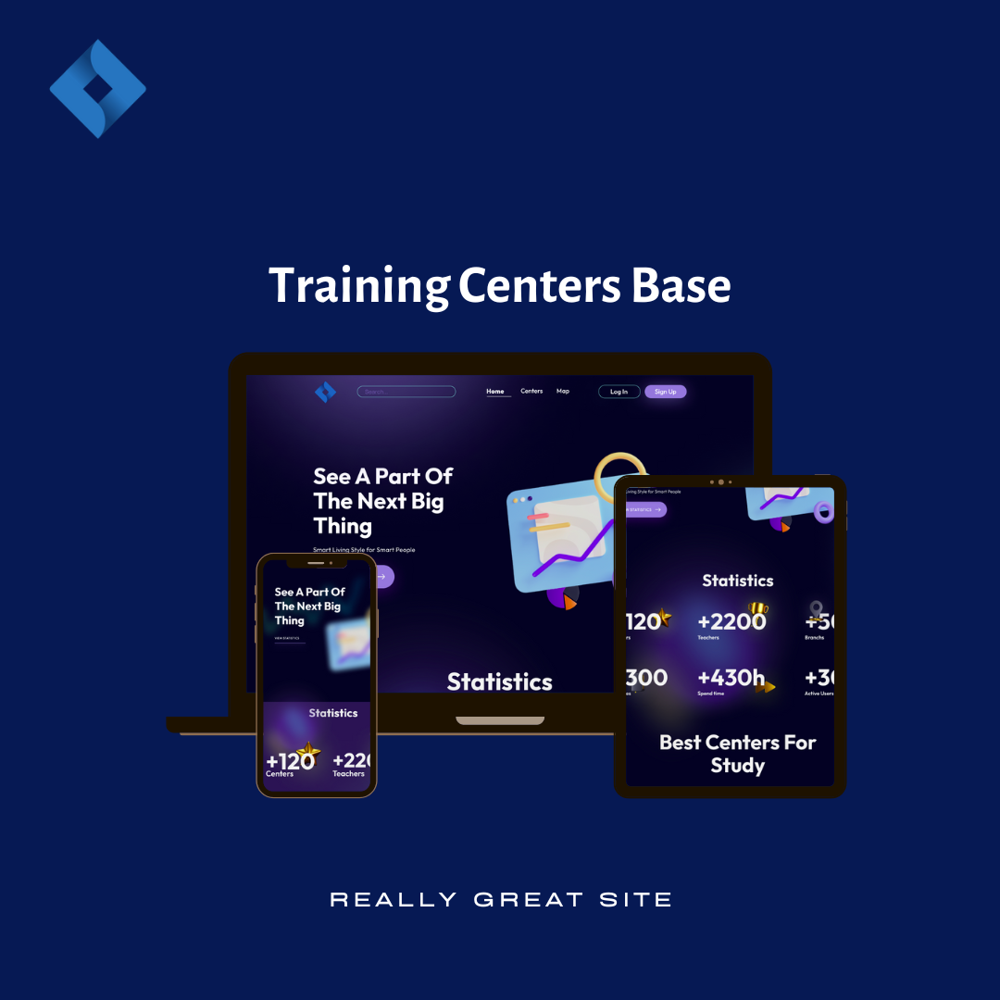

## Welcome to
# TCB (Training Centers Base)



### About the Project

This project is an `Base of Centers` and was created for people who looking for centers for themselves otherwise clients 
are able to publish their centers in `TCB`. Visitors have a lot of features just like they can find any centers `faster`, 
they can `filter` center by our `statistic` or by their `number of students`, `branches`... Additional, Visitors have 
access to `Top Teachers` of centers. We used to [Celery](https://docs.celeryq.dev/en/stable/) for sending mailing messages
to users and [Flower](https://flower.readthedocs.io/en/latest/) for observe processes of tasks of 
[Celery](https://docs.celeryq.dev/en/stable/) as Dashboard

### About the BackEnd

This project raised in architecture `MVT` `(Model View Template)`. There are email verification, multilanguage, user token, 
calculate statistics each centers and other features.

### About the FrontEnd
You can view project in github with link: https://github.com/MZayniddin/TCB


***

## Tech

* [Django](https://www.djangoproject.com/) - is a high-level `Python Web framework`
* [Django REST framework](https://www.django-rest-framework.org/) - `Django REST Framework` is a powerful and flexible toolkit for building Web `APIs`
* [PostgreSQL](https://www.postgresql.org/) - open source object-relational database system

And many other libraries.

Dillinger requires [Python](https://www.python.org) `v3.6+` or `v3.10`.

```shell
$ git clone https://github.com/Abduraxmonnn/tcb_api.git
$ cd tcb_api
```

***

## Setting project

* `Linux`
```shell
$ virtualenv -p /usr/bin/python3 .venv
$ source .venv/bin/activate
$ pip install -r requirements.txt
$ python manage.py migrate
```

* `Windows`
```shell
$ python -m venv ./venv
$ venv\Scripts\activate
$ pip install -r requirements.txt
$ python manage.py migrate
```

* `MacBook`
```shell
$ python3 -m venv venv
$ source venv/bin/activate
$ pip install -r requirements.txt
$ python manage.py migrate
```

***

### Requirements before the Run

Make sure you set up your `email` to send SMS to users and correct work of project.
There are variables in settings.py that start with `EMAIL` which you have to set your `email details`.

## Development
### Configure `PostgreSQL`
Create clear database named `tcb_db`.

Create `tcb_user` db user with password `tcb_12345` and grand privileges to him.

If you want to create a database with a different name, user and password, you can change the initial configuration to your own configuration.
```shell
$ sudo -u postgres psql
postgres=# ...
CREATE DATABASE tcb_db;
CREATE USER tcb_user WITH PASSWORD 'tcb_12345';
ALTER ROLE tcb_user SET client_encoding TO 'utf8';
ALTER ROLE tcb_user SET default_transaction_isolation TO 'read committed';
ALTER ROLE tcb_user SET timezone TO 'Tashkent/Asia';
GRANT ALL PRIVILEGES ON DATABASE ocean_db TO tcb_user;
\q
```
Migrate to database and run project.
```shell
$ python manage.py makemigrations
$ python manage.py migrate
$ python manage.py runserver
```
`Output`
```shell
System check identified no issues (0 silenced).
Month date, year - hh:mm:ss
Django version 4.1.7, using settings 'config.settings'
Starting development server at http://127.0.0.1:8000/
Quit the server with CONTROL-C.
```
Open http://127.0.0.1:8000 in your browser for see result.
