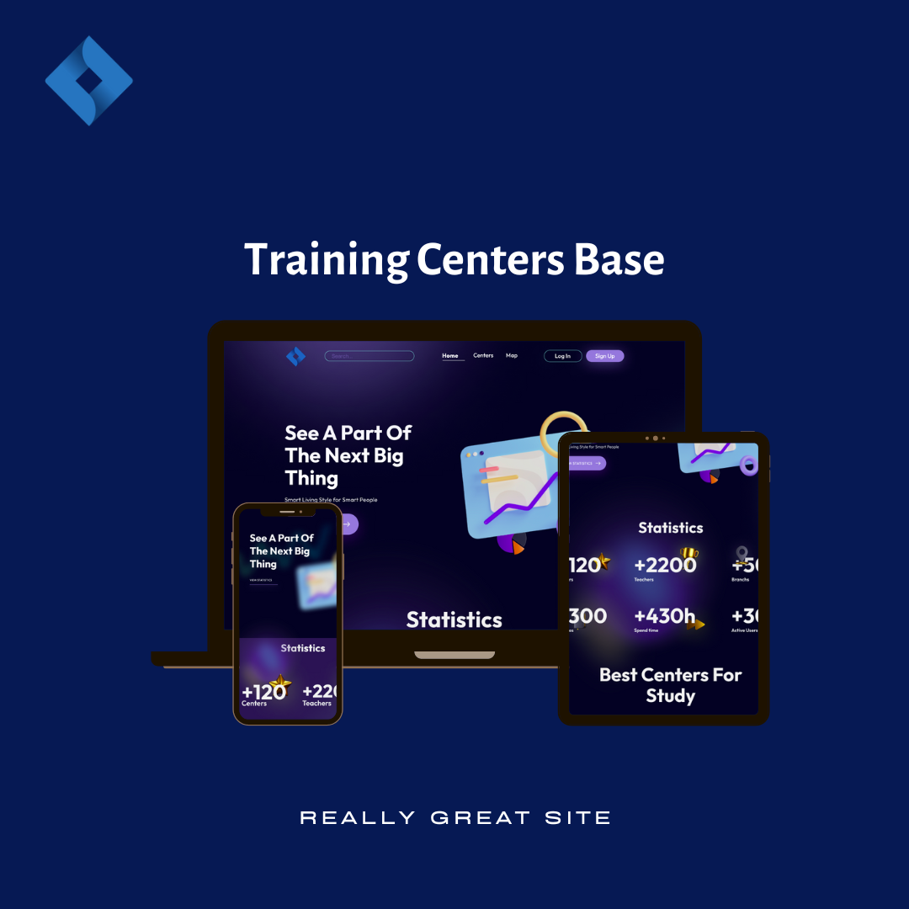

## Welcome to
# TCB (Training Centers Base)



[//]: # (### About the project)

[//]: # (This project is an `online library` and was created for people who love to `read books` and `save their time`. )

[//]: # (People can `bookmark`, `like` and `rate`, when people bookmark, they can read these books after a while, because these books will be bookmarked. )

[//]: # (Moreover, people can rate so that others can see how good, `high quality` and `interesting` the book is. )

[//]: # (They can leave `feedback` at any time and help in the development of our project. People who like our work, website, can make a `donation` to support us and our work. )

[//]: # (In addition, they can follow our `social networks`.)

[//]: # ()
[//]: # (### About the BackEnd)

[//]: # (This project was created in `MVC &#40;Model, View, Controller&#41;` architecture. )

[//]: # (In addition, the project works in `PostgreSQL`. We have used `AbstractBaseUser` to create a user and the user has its )

[//]: # (own user manager, also we are using a `Token` to generate tokens for secure our user. There are many libraries and packages that support our)

[//]: # (project, such as `Django-Rest-Framework` for creating `APIs`, `Pillow` for photo processing, `psycopg2-binary` for `PostgreSQL`, and others.)

[//]: # ()
[//]: # (***)

## Tech

* [Django](https://www.djangoproject.com/) - is a high-level `Python Web framework`
* [Django REST framework](https://www.django-rest-framework.org/) - `Django REST Framework` is a powerful and flexible toolkit for building Web `APIs`
* [PostgreSQL](https://www.postgresql.org/) - open source object-relational database system

And many other libraries.

Dillinger requires [Python](https://www.python.org) v3.4+.

```shell
$ git clone https://github.com/Abduraxmonnn/tcb_api.git
$ cd tcb_api
```

***

## Setting project

* `Linux`
```shell
$ virtualenv -p /usr/bin/python3 .venv
$ source .venv/bin/activate
$ pip install -r requirements.txt
$ python manage.py migrate
```

* `Windows`
```shell
$ python -m venv ./venv
$ venv\Scripts\activate
$ pip install -r requirements.txt
$ python manage.py migrate
```

* `MacBook`
```shell
$ python3 -m venv venv
$ source venv/bin/activate
$ pip install -r requirements.txt
$ python manage.py migrate
```

***

## Development
### Configure `PostgreSQL`
Create clear database named `tcb_db`.

Create `tcb_user` db user with password `tcb_12345` and grand privileges to him.

If you want to create a database with a different name, user and password, you can change the initial configuration to your own configuration.
```shell
$ sudo -u postgres psql
postgres=# ...
CREATE DATABASE ocean_db;
CREATE USER tcb_user WITH PASSWORD 'tcb_12345';
ALTER ROLE tcb_user SET client_encoding TO 'utf8';
ALTER ROLE tcb_user SET default_transaction_isolation TO 'read committed';
ALTER ROLE tcb_user SET timezone TO 'Tashkent/Asia';
GRANT ALL PRIVILEGES ON DATABASE ocean_db TO tcb_user;
\q
```
Migrate to database and run project.
```shell
$ python manage.py makemigrations
$ python manage.py migrate
$ python manage.py runserver
```
`Output`
```shell
System check identified no issues (0 silenced).
Month date, year - hh:mm:ss
Django version 4.1.7, using settings 'config.settings'
Starting development server at http://127.0.0.1:8000/
Quit the server with CONTROL-C.
```
Open http://127.0.0.1:8000 in your browser for see result.
